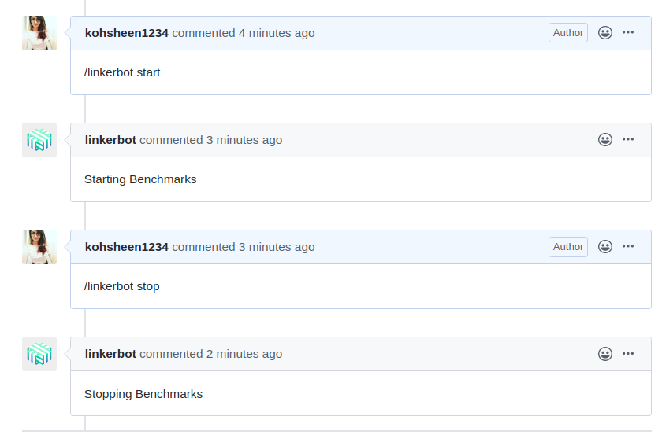

- Contribution Name: Scale Testing
- Implementation Owner:  ['kohsheen1234'](https://github.com/kohsheen1234)
- Start Date: 29-02-2020
- Target Date: 
- RFC PR:
- Linkerd Issue: [linkerd/linkerd2#3895](https://github.com/linkerd/linkerd2/issues/3895)
- Reviewers: 

[summary]: #summary

# Summary
This contribution aims to completely automate the scale test framework, to ensure the scale tests are repeatable by the community. Automating scale tests serve to provide visibility into the proxy's performance and reveal any performance degradation.
# Problem Statement (Step 1)

[problem-statement]: #problem-statement

- Identify performance regression/potential errors with minimal manual intervention.
- Latency in the network communication can be a massive issue. When new features added to Linkerd, it might deteriorate the performance of Linkerd. So, it is important to understand if any new feature which has been added recently has a negative impact on Linkerd's performance. Manually checking every time if there has been a regression in the performance is not a convenient solution. This process can be automated, so that it is very simple to perform scale testing.
- Once this scale testing has been automated,the scale test framework will be able to :
  - Automatically add a sample workload to the cluster.
  - Record cluster,control pane and data plane metrics during the test.
    - Success rate
    - Latency and throughput
    - Dashboard load times
    - `linkerd stat` responsiveness
    - Prometheus cpu/memory usage
  - Report on resource usage, Linkerd performance and potential errors encountered.

# Design proposal (Step 2)

[design-proposal]: #design-proposal

 The process of automation has a few steps to it, the below mentioned is the procedure that can be followed to achieve the desired automation. If time permits a **Github Bot** can be created that performs Scale and Performance Testing.

### PART 1 :  

### Automate Installation linkerd along with other resources such as Kubernetes cluster

[Part-1]: #Part-1

Create a script file which performs the following actions:
1. Create a GKE cluster
1. Check if kubectl binary is available
2. Check if linkerd binary is available
3. Check if connection to cluster can be established via kubectl
4. Check if Linkerd control plane is installed

using a service mesh will have a cluster consume more resources for its operation, taking resources away from business logic. In order to better understand this impact we measure both CPU load of, and memory consumed by the service mesh control plane, and the service mesh's application proxy sidecars. 

- Create a script that installs linkerd in HA (High Avalibility mode)
  
```sh

# mentioned version here, can be changed to edge version also
release="${1:-stable-2.6.0}"

# To install Linkerd CLI
curl -sL https://run.linkerd.io/install | sh

# Add Linkerd to your path
export PATH=$PATH:$HOME/.linkerd2/bin

# Verify the CLI is installed and running correctly
linkerd version

kubectl create clusterrolebinding cluster-admin-binding-$USER \
   --clusterrole=cluster-admin --user=$(gcloud config get-value account)

# To check that your cluster is configured correctly and ready to install the control plane
linkerd check --pre

#enable HA mode at control plane installation time with the --ha flag
linkerd install --ha| kubectl apply -f -

# Validate the intallation
linkerd check

```

- For load testing, the setup requires a very large cluster - at least 32 vCPUs reserved for Linkerd would be recommended. The defaults values are 32vCP and at least 4 nodes.

- For testing stability and e2e behavior in small clusters - 4vCPU per node and 1 node with auto-scaling should work.

- The aim is to make the scale test infractructure runs with [Github Actions](https://github.com/features/actions) on a [Google Kubernetes Engine Cluster](https://cloud.google.com/kubernetes-engine/) or with a single line command locally.

- Set the following environment variables and deploy the cluster.

```sh
  export PROJECT_ID=<google-cloud project-id>
  export CLUSTER_NAME=prombench
  export ZONE=us-east1-b
  export AUTH_FILE=<path to service-account.json>

  ./prombench gke cluster create -a $AUTH_FILE -v PROJECT_ID:$PROJECT_ID \
      -v ZONE:$ZONE -v CLUSTER_NAME:$CLUSTER_NAME -f manifests/cluster.yaml
```

- Script to create a deafult GKE Cluster

```sh
# Creates a standard GKE cluster for testing.

# get default GKE cluster version for zone

- Function can be used to create clusters along with resources.

```go
  func K8Clusters {
    g := gke.New()

    k8sGKE := app.Command("gke", `Google container engine provider - https://cloud.google.com/kubernetes-engine/`).
        Action(g.NewGKEClient)
    k8sGKE.Flag("auth", "json authentication for the project. Accepts a filepath or an env variable that inlcudes tha json data. If not set the tool will use the GOOGLE_APPLICATION_CREDENTIALS env variable (export GOOGLE_APPLICATION_CREDENTIALS=service-account.json). https://cloud.google.com/iam/docs/creating-managing-service-account-keys.").
        PlaceHolder("service-account.json").
        Short('a').
        StringVar(&g.Auth)
    k8sGKE.Flag("file", "yaml file or folder  that describes the parameters for the object that will be deployed.").
        Required().
        Short('f').
        ExistingFilesOrDirsVar(&g.DeploymentFiles)
    k8sGKE.Flag("vars", "When provided it will substitute the token holders in the yaml file. Follows the standard golang template formating - {{ .hashStable }}.").
        Short('v').
        StringMapVar(&g.DeploymentVars)

    // Cluster operations.
    k8sGKECluster := k8sGKE.Command("cluster", "manage GKE clusters").
        Action(g.GKEDeploymentsParse)
    k8sGKECluster.Command("create", "gke cluster create -a service-account.json -f FileOrFolder").
        Action(g.ClusterCreate)
    k8sGKECluster.Command("delete", "gke cluster delete -a service-account.json -f FileOrFolder").
        Action(g.ClusterDelete)

    // Cluster node-pool operations
    k8sGKENodePool := k8sGKE.Command("nodepool", "manage GKE clusters nodepools").
        Action(g.GKEDeploymentsParse)
    k8sGKENodePool.Command("create", "gke nodepool create -a service-account.json -f FileOrFolder").
        Action(g.NodePoolCreate)
    k8sGKENodePool.Command("delete", "gke nodepool delete -a service-account.json -f FileOrFolder").
        Action(g.NodePoolDelete)
    k8sGKENodePool.Command("check-running", "gke nodepool check-running -a service-account.json -f FileOrFolder").
        Action(g.AllNodepoolsRunning)
    k8sGKENodePool.Command("check-deleted", "gke nodepool check-deleted -a service-account.json -f FileOrFolder").
        Action(g.AllNodepoolsDeleted)

    // K8s resource operations.
    k8sGKEResource := k8sGKE.Command("resource", `Apply and delete different k8s resources - deployments, services, config maps etc.Required variables -v PROJECT_ID, -v ZONE: -west1-b -v CLUSTER_NAME`).
        Action(g.NewK8sProvider).
        Action(g.K8SDeploymentsParse)
    k8sGKEResource.Command("apply", "gke resource apply -a service-account.json -f manifestsFileOrFolder -v PROJECT_ID:test -v ZONE:europe-west1-b -v CLUSTER_NAME:test -v hashStable:COMMIT1 -v hashTesting:COMMIT2").
        Action(g.ResourceApply)
    k8sGKEResource.Command("delete", "gke resource delete -a service-account.json -f manifestsFileOrFolder -v PROJECT_ID:test -v ZONE:europe-west1-b -v CLUSTER_NAME:test -v hashStable:COMMIT1 -v hashTesting:COMMIT2").
        Action(g.ResourceDelete)

}

```

- Create 1000 pods.
- Create 1000 services.
- 1000 RPS for a single pod.
  
---

- ## Add sample workload to cluster
  
  [part-2]: #part-2
  - For our purposes, the application **`Emojivoto`** can be added as the workload to our cluster. 
  - *Emojivoto* uses a HTTP microservice by the name of **`web-svc`** (of kind: load-balancer) as its front-end. **`web-svc`** communicates via gRPC with the **`emoji-svc`** and **`voting-svc`** back-ends, which provide emojis and handle votes, respectively. 
  - We picked Emojivoto because it is clear and simple in structure, yet contains all elements of a cloud-native application that are important to us for benchmarking service meshes.
  - To make sure that the scale test is not highly time-consuming, the `scale test infrastructure` can define the **number of namespace** as well as the **number of replicas of each deployment** in a script file, so as to make it convinient for the user to run scale test without worrying about the specifications.

As specified in the scale testing issue [#3692](https://github.com/linkerd/linkerd2/issues/3692), we will stick to the same .

- **49 `emojivoto` namespaces**
  - The deployments of **`Emojivoto`** are specified in  `emojivoto.yaml` i.e vote-bot, web, voting and emoji.
  - In the scale test script we will create 4 deployments(same as the ones mentioned above) of 5 replicas for a total of 20 pods per namespace. 
  - Hence, the total number of pods will be : 20 pods per namespace * 49 namespaces = 980 pods (these pods are not very "connected". each pod is connected to at most 1 upstream deployment of 5 replicas and 2 downstream deployments of 5 replicas each for a total of 15 connections)

    ```sh
    # Define namespace and replicas
    NAMESPACES=49
    REPLICAS=5
    # Deploy Emojivoto
    EMOJIVOTO=$(curl -s https://run.linkerd.io/emojivoto.yml)

    # inject
    EMOJIVOTO=$(echo "$EMOJIVOTO" | "$linkerd_path" -l $linkerd_namespace inject -)

    for i in $(eval echo {1..$NAMESPACES}); do
        emojins=$linkerd_namespace-emoji-$i

        kubectl create ns $emojins
        echo "$EMOJIVOTO" | kubectl apply -n $emojins -f -

        kubectl -n $emojins scale --replicas=$REPLICAS deploy/emoji deploy/voting deploy/web deploy/vote-bot
    done
    ```

- **1 `slowcooker` namespace**
  With 1 slowcooker deployment of 20 replicas. The slowcookers fanout traffic to each of the web services in each of the emojivoto deployments (these pods are highly "connected". Each pod is connected to 49 deployments of 5 replicas each for a total of 245 connections). Here, there are a total of 1000 pods.

  ```yaml
  kind: Deployment
  metadata:
    name: baseline
    namespace: slow-cooker-namepsace
  spec:
    selector:
      matchLabels:
        app: baseline
    template:
      metadata:
        labels:
          app: baseline
          replicas : 20
      spec:
        containers:
        - name: slow-cooker
          image: buoyantio/slow_cooker:1.2.0
          args:
          - "-metric-addr=0.0.0.0:9998"
          - "-qps=100"
          - "-concurrency=10"
          - "-interval=10s"
          - "http://localhost:8080"
          ports:
          - name: slow-cooker
            containerPort: 9998
  ```

---

- ## Record cluster, control plane and data plane metrics during the test.

[part-3]: #part-3

  Internally, Linkerd stores its metrics in a Prometheus instance that runs as part of the control plane. The performance testing infrastructure is essentially used to measure tail latenties, higher percentiles like p99 matter more to us. There are several basic approaches to exporting metrics data from Linkerd:

- ## Create a Reporter
  [part-4]: #part-4

  - A benchmark measuring **`tail latency`, `CPU usage`, and `memory consumption`**— the three metrics we believe are most indicative of the cost of operating a service mesh.
  - A **comparison to the baseline** of not using a service mesh at all. For our benchmarks, we use **[wrk2](https://github.com/giltene/wrk2)** to generate load and to measure round-trip latency from the request initiator side. 
  - *Latency* is arguably the most important number for a service mesh, since it measures the user-facing (as opposed to operator-facing) impact of a service mesh, for our test infrastructure we considerthe condition of **100 RPS**.
  - *CPU utilization* and *memory consumption* are measured in short intervals on a per-container level during test runs, the maximum resource consumption of components during individual runs will be selected, and the median over all test runs is to be calculated and presented as a result.
  - When the test is run as a command locally. It should be able to report the recorded information which consists the following :

```go
const (
    successRateQuery = "sum(rate(successes{job=~\"strest-client|slow-cooker\"}[5m])) by (app, job) / sum(rate(requests{job=~\"strest-client|slow-cooker\"}[5m])) by (app, job)"
    requestRateQuery = "sum(rate(requests{job=~\"strest-client|slow-cooker\"}[5m])) by (app, job)"
    latencyQuery     = "histogram_quantile(%f, sum(rate(latency_us_bucket{job=~\"strest-client|slow-cooker\"}[5m])) by (le, app, job))"
    memoryQuery      = "sum(container_memory_working_set_bytes{}) by (container_name, pod_name)"
    cpuQuery         = "sum(rate(container_cpu_usage_seconds_total{}[5m])) by (container_name, pod_name)"
)
```

- We can create a structure for all the stats that are to be reported. The format could be similar to as follows -
  
  ```go
  type stats struct {
    sr        float64
    rr        uint64
    latencies map[float64]uint64
    mem       uint64
    cpu       float64
  }

  ```

- Function which is to be called  when trying to get metrics.
  
```go

func queryProm(promAPI promv1.API, query string) (model.Vector, error) {
    log.Debugf("Prometheus query: %s", query)

    res, err := promAPI.Query(context.Background(), query, time.Time{})
    if err != nil {
        log.Errorf("Prometheus query(%+v) failed with: %+v", query, err)
        return nil, err
    }
    log.Debugf("Prometheus query response: %+v", res)

    if res.Type() != model.ValVector {
        err = fmt.Errorf("Unexpected query result type (expected Vector): %s", res.Type())
        log.Error(err)
        return nil, err
    }

    return res.(model.Vector), nil
}
```

```go
//PromAPI
promAPI := promv1.NewAPI(promClient)

//Metric calls for calculation
sr, err := queryProm(promAPI, successRateQuery)
rr, err := queryProm(promAPI, requestRateQuery)
latencyResults := map[float64]model.Vector{}
mem, err := queryProm(promAPI, memoryQuery)
cpu, err := queryProm(promAPI, cpuQuery)
```

- When we try to run the command as a comment on github, the following details should be displayed by the linkerd_scale_test_bot:
  - The services will be accessible at:
    - Grafana :: http://<DOMAIN_NAME>/grafana
    - Prometheus :: http://<DOMAIN_NAME>/prometheus-meta
    - Logs :: http://<DOMAIN_NAME>/grafana/explore

---

# Deliverables

---

# Non Goals

[non-goals]: #non-goals

The implementation of the above scale-testing infrastructure should not in any way effect the performance of Linkerd.

---

# Prior art

[prior-art]: #prior-art

- Scale and performance testing is included in other service mesh. 
  - For instance, let's consider Istio https://istio.io/docs/ops/deployment/performance-and-scalability/. 

  - Github link - https://github.com/istio/tools/tree/release-1.4/perf

- Current scale-test of linkerd - https://github.com/linkerd/linkerd2/blob/master/bin/test-scale 

- PromBot - [PrombotCommentGithub](https://github.com/prometheus/prometheus/pull/6679)

- https://linkerd.io/2019/05/18/linkerd-benchmarks/
  
- https://github.com/linkerd/linkerd-examples/tree/master/perf-baseline

- https://linkerd.io/2019/05/18/linkerd-benchmarks/

- https://kinvolk.io/blog/2019/05/performance-benchmark-analysis-of-istio-and-linkerd/

- https://kubernetes.io/docs/reference/kubectl/cheatsheet/
  
- https://github.com/linkerd/linkerd-viz
  
- https://github.com/kinvolk/service-mesh-benchmark
  
- https://github.com/giltene/wrk2

- https://github.com/linkerd/linkerd2/issues/3692#issuecomment-564695766

- https://www.youtube.com/watch?v=Bj7gGQUiDuk

- https://github.com/linkerd/linkerd-examples/tree/master/lifecycle
- https://www.youtube.com/watch?v=qEqAArMD2qU

---

# Unresolved questions

[unresolved-questions]: #unresolved-questions

---

# Future possibilities

[future-possibilities]: #future-possibilities

- If time permits, all the tests can be run via a single comment in github.
- This can be performed with the help of GitHub Actions.


